# Q. 21 - 30

## Q.26. Bi-linear補間

Bi-linear補間により画像を1.5倍に拡大せよ。

Bi-linear補間とは周辺の４画素に距離に応じた重みをつけることで補完する手法である。
計算量が多いだけ処理時間がかかるが、画質の劣化を抑えることができる。

1. 拡大画像の座標(x', y')を拡大率aで割り、floor(x'/a, y'/a)を求める。
2. 元画像の(x'/a, y'/a)の周囲4画素、I(x,y), I(x+1,y), I(x,y+1), I(x+1, y+1)を求める

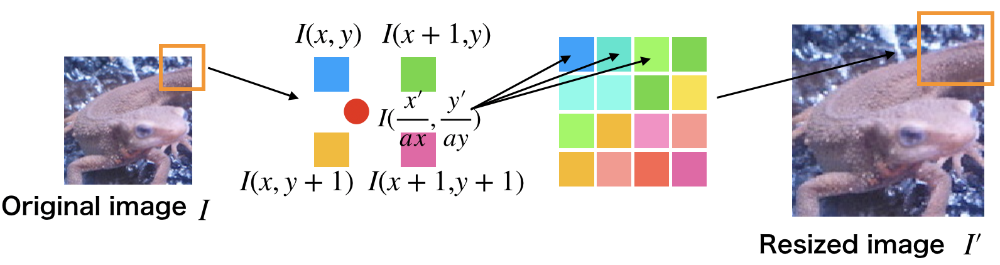

<!--
```bash
I(x,y)    I(x+1,y) 
     * (x'/a,y'/a)
I(x,y+1)  I(x+1,y+1)
```
-->

3. それぞれの画素と(x'/a, y'/a)との距離dを求め、重み付けする。 w = d / Sum d
4. 次式によって拡大画像の画素(x',y')を求める。 
dx = x'/a - x , dy = y'/a - y

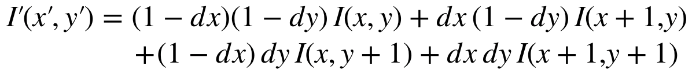

<!--
```bash
I'(x',y') = (1-dx)(1-dy)I(x,y) + dx(1-dy)I(x+1,y) + (1-dx)dyI(x,y+1) + dxdyI(x+1,y+1)
```
-->

|入力 (imori.jpg)|出力 (answers_image/answer_26.jpg)|
|:---:|:---:|
|||

答え 
- Python >> [answers_py/answer_26.py](answers_py/answer_26.py)
- C++ >> [answers_cpp/answer_26.cpp](answers_cpp/answer_26.cpp)

## Q.27. Bi-cubic補間

Bi-cubic補間により画像を1.5倍に拡大せよ。

Bi-cubic補間とはBi-linear補間の拡張であり、周辺の16画素から補間を行う。

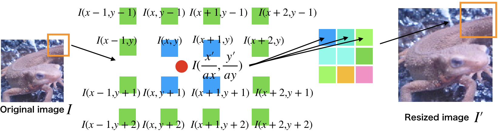

<!--
```bash
I(x-1,y-1)  I(x,y-1)  I(x+1,y-1)  I(x+2,y-1)
I(x-1,y)    I(x,y)    I(x+1,y)    I(x+2,y)
I(x-1,y+1)  I(x,y+1)  I(x+1,y+1)  I(x+2,y+1)
I(x-1,y+2)  I(x,y+2)  I(x+1,y+2)  I(x+2,y+2)
```
-->

それぞれの画素との距離は次式の様に決定される。

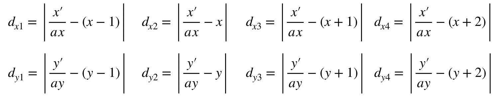

<!--
```bash
dx1 = x'/a - (x-1) , dx2 = x'/a - x , dx3 = (x+1) - x'/a , dx4 = (x+2) - x'/a
dy1 = y'/a - (y-1) , dy2 = y'/a - y , dy3 = (y+1) - y'/a , dy4 = (y+2) - y'/a
```
-->

重みは距離によって次の関数により決定される。
a は多くの場合-1をとる。だいたい図の青色のピクセルは距離|t|<=1、緑色が1<|t|<=2の重みとなる。

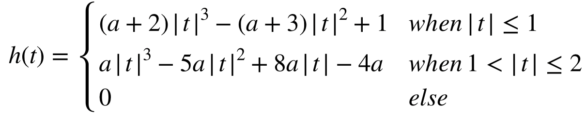

<!--
```bash
h(t) = { (a+2)|t|^3 - (a+3)|t|^2 + 1    (when |t|<=1)
         a|t|^3 - 5a|t|^2 + 8a|t| - 4a  (when 1<|t|<=2)
         0                              (when 2<|t|) 
```
-->

これら画素と重みを用いて、次式で拡大画像の画素が計算される。
それぞれの画素と重みを掛けた和を重みの和で割る。

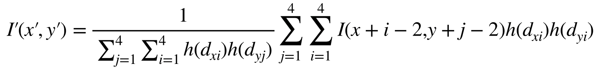

<!--
```bash
I'(x', y') = (Sum{i=-1:2}{j=-1:2} I(x+i,y+j) * wxi * wyj) / Sum{i=-1:2}{j=-1:2} wxi * wyj
```
-->

|入力 (imori.jpg)|出力 (answers_image/answer_27.jpg)|
|:---:|:---:|
|||

答え 
- Python >> [answers_py/answer_27.py](answers_py/answer_27.py)
- C++ >> [answers_cpp/answer_27.cpp](answers_cpp/answer_27.cpp)

## Q.28. アフィン変換(平行移動)

アフィン変換を利用して画像をx方向に+30、y方向に-30だけ平行移動させよ。

アフィン変換とは3x3の行列を用いて画像の変換を行う操作である。

変換は(1)平行移動(Q.28) (2)拡大縮小(Q.29) (3)回転(Q.30) (4)スキュー(Q.31) がある。

元画像を(x,y)、変換後の画像を(x',y')とする。
画像の拡大縮小は、次式で表される。

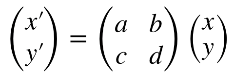

<!--
```bash
[ x' ] = [a b][x]
  y'      c d  y
```
-->

一方、平行移動は次式となる。

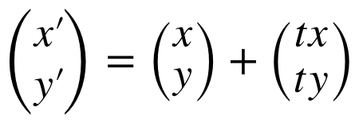

<!--
```bash
[ x' ] = [x] + [tx]
  y'      y  +  ty
```
-->

以上を一つの式にまとめると、次式になり、これがアフィン変換である。

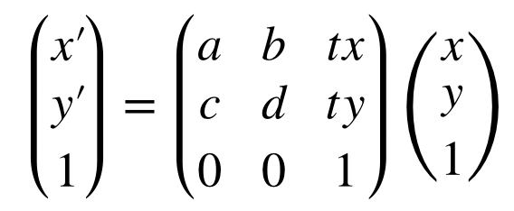

<!--
```bash
  x'       a b tx    x
[ y' ] = [ c d ty ][ y ]
  1        0 0  1    1
```
-->

しかし実装する時は、元画像に対して１ピクセルずつ行うと、処理後の画像で値が割り当てられない可能性がでてきてしまう。よって、処理後画像の各ピクセルに対してAffine変換の逆変換を行い、値をあ割り当てる元画像の座標を取得する必要がある。Affine変換の逆操作は次式となる。

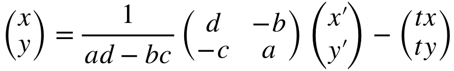

今回の平行移動では次式を用いる。tx, tyが平行移動のピクセルの移動距離となる。

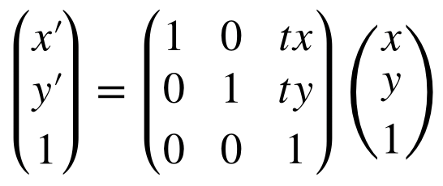

<!--
```bash
  x'       1 0 tx    x
[ y' ] = [ 0 1 ty ][ y ]
  1        0 0  1    1
```
-->

|入力 (imori.jpg)|出力 (answers_image/answer_28.jpg)|
|:---:|:---:|
|||

答え 
- Python >> [answers_py/answer_28.py](answers_py/answer_28.py)
- C++ >> [answers_cpp/answer_28.cpp](answers_cpp/answer_28.cpp)

## Q.29. アフィン変換(拡大縮小)

アフィン変換を用いて、(1)x方向に1.3倍、y方向に0.8倍にリサイズせよ。

また、(2)  (1)の条件に加えて、x方向に+30、y方向に-30だけ平行移動を同時に実現せよ。

|入力 (imori.jpg)|出力 (1) (answers_image/answer_29_1.jpg)|出力 (2) (answers_image/answer_29_2.jpg)|
|:---:|:---:|:---:|
||||

答え 
- Python >> [answers_py/answer_29.py](answers_py/answer_29.py)
- C++ >> [answers_cpp/answer_29.cpp](answers_cpp/answer_29.cpp)

## Q.30. アフィン変換(回転)

(1)アフィン変換を用いて、反時計方向に30度回転させよ。

(2) アフィン変換を用いて、反時計方向に30度回転した画像で中心座標を固定することで、なるべく黒い領域がなくなるように画像を作成せよ。
（ただし、単純なアフィン変換を行うと画像が切れてしまうので、工夫を要する。）

アフィン変換において、反時計方向にA度回転させる時は、次式となる。

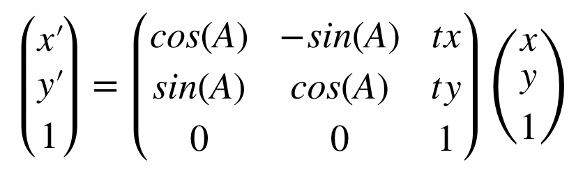

<!--
```bash
  x'       cosA -sinA tx    x
[ y' ] = [ sinA  cosA ty ][ y ]
  1         0     0    1    1
```
-->

|入力 (imori.jpg)|出力 (1) (answers_image/answer_30_1.jpg)|出力 (2) (answers_image/answer_30_2.jpg)|
|:---:|:---:|:---:|
||||

答え >> 

答え 
- Python >> [answers_py/answer_30.py](answers_py/answer_30.py) , 
- C++ >> [answers_cpp/answer_30.cpp](answers_cpp/answer_30.cpp)
